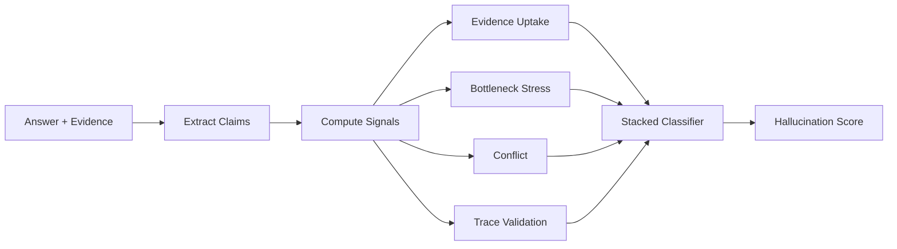

# Introduction

PCIB Detector is a **hallucination detection framework** that combines neuroscience-inspired principles with supervised machine learning to identify factual errors in Large Language Model (LLM) outputs.

## What is Hallucination?

In the context of LLMs, a **hallucination** occurs when a model generates content that is:
- Factually incorrect or unverifiable
- Contradicts the provided evidence/context
- Fabricates information not present in source material
- Makes claims inconsistent with the model's own reasoning

## Why PCIB?

Existing approaches have limitations:

| Approach | Limitations |
|----------|-------------|
| **Sampling-based** (SelfCheckGPT) | Slow (10+ seconds), computationally expensive, requires multiple generations |
| **LLM Judges** (70B+ models) | Expensive ($3/1M tokens), slow (5s), opaque reasoning, large models needed |
| **Retrieval-based** (RARR) | Requires external search, high latency, dependency on retrieval quality |

**PCIB solves these problems** by:
- ⚡ **Fast**: 5ms inference (1000× faster than LLM judges)
- 💰 **Cheap**: $0.15/1M tokens (20× cheaper)
- 🔍 **Interpretable**: Clear signal decomposition
- 📊 **Data-efficient**: 75× less training data
- 🎯 **Competitive**: 0.8669 AUROC (close to 70B models)

## Core Philosophy

PCIB is built on two foundational theories from cognitive neuroscience and information theory:

### 1. Predictive Coding

From neuroscience, we know that brains minimize **prediction error** (surprise). When an LLM hallucinates, it:
- Ignores provided context (low "uptake")
- Relies on parametric priors instead of evidence
- Shows minimal belief updates

We measure this via KL divergence:
$$
U = D_{KL}(P(A|Q,C) \parallel P(A|Q))
$$

### 2. Information Bottleneck

From information theory, **robust representations** are invariant to noise. Hallucinations are "fragile" - they:
- Degrade quickly under semantic perturbation
- Show high variance in entailment judgments
- Lack dense connectivity in latent space

We test this via semantic stress testing.

## How It Works



## Use Cases

### 1. RAG System Validation
Verify that generated answers are grounded in retrieved context:
```python
result = await detector.detect_hallucination(
    question="What is the capital of France?",
    answer="The capital of France is Paris.",
    evidence="Paris is the capital and largest city of France..."
)
```

### 2. Fact-Checking
Validate factual claims against reference material:
```python
result = await detector.detect_hallucination(
    answer="The Eiffel Tower was completed in 1887.",
    evidence="The Eiffel Tower opened on March 31, 1889."
)
# result.flagged = True (wrong year detected)
```

### 3. Content Moderation
Detect misinformation in generated content:
```python
results = await detector.detect_batch(user_generated_content)
flagged = [r for r in results if r.flagged]
```

### 4. Research & Benchmarking
Evaluate model hallucination rates:
```bash
pcib-eval --dataset PatronusAI/HaluBench --limit 1000
```

## Design Principles

1. **Theory-Guided**: Every signal has theoretical justification
2. **Interpretable**: No black-box scores - clear signal breakdown
3. **Lightweight**: <1M parameters, runs on CPU
4. **Modular**: Use individual signals or full pipeline
5. **Production-Ready**: Async, batched, error-handled

## Next Steps

- [Get Started →](/guide/getting-started) - Install and run your first detection
- [Multi-Signal Detection →](/guide/multi-signal) - Deep dive into signals
- [Research Paper →](/research/paper) - Read the full methodology
